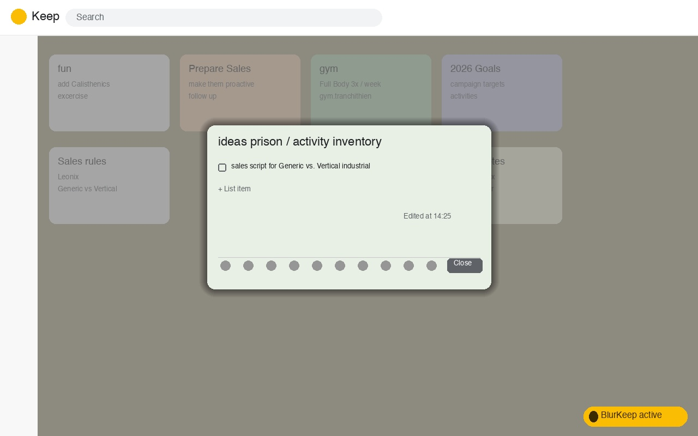

# BlurKeep

A small Firefox extension that blurs your other notes in [Google Keep](https://keep.google.com) while you're editing one, so you can focus without the rest of the board pulling your eye.



## Features

- Automatically blurs the notes grid whenever a note is open for editing
- Adjustable blur intensity (1–12px) from the toolbar popup
- One-click enable/disable toggle
- Settings persist per-browser via `storage.local`
- No data collection, no permissions beyond `storage` and `activeTab`

## Installation

### From addons.mozilla.org (AMO)

Once published, install directly from the Firefox Add-ons store (link TBD).

### Temporary install (for testing)

1. Open Firefox and go to `about:debugging#/runtime/this-firefox`
2. Click **Load Temporary Add-on…**
3. Select `manifest.json` from this repo

The extension is removed automatically when Firefox restarts — use this for quick testing only.

## Project structure

```
manifest.json        Extension manifest (Manifest V2, Gecko)
content.js            Injected into keep.google.com — detects when a note is open and toggles the blur
content.css           Blur/overlay styles
popup.html / popup.js Toolbar popup UI (enable toggle + blur intensity slider)
icons/                Toolbar icons (SVG)
icon-128.jpg          AMO listing icon
screenshot.jpg        AMO listing screenshot
generate_assets.py    Regenerates icon-128.jpg and screenshot.jpg from scratch (Pillow)
```

## Development

No build step is required — this is a plain WebExtension. To try changes:

1. Edit the source files
2. Reload the temporary add-on at `about:debugging#/runtime/this-firefox` (or run `npm run dev`, see below)

### Tooling setup

```bash
npm install
```

This installs [`web-ext`](https://github.com/mozilla/web-ext), Mozilla's official CLI for linting, running, building, and signing WebExtensions.

| Command | What it does |
|---|---|
| `npm run dev` | Launches Firefox with BlurKeep loaded and live-reloaded on file changes |
| `npm run lint` | Runs `web-ext lint` against the AMO validator rules |
| `npm run build` | Produces a versioned `.zip` in `web-ext-artifacts/` |
| `npm run sign` | Lints, builds, and submits the package to AMO for signing (see below) |
| `npm run bump -- <patch\|minor\|major>` | Bumps the version in `manifest.json` + `package.json`, commits, and tags |
| `npm run upload-assets` | Uploads `icon-128.jpg` and `screenshot.jpg` to the AMO listing (see below) |

Regenerating the store assets (only needed if you change the icon/screenshot design):

```bash
pip install pillow
python3 generate_assets.py
```

## Publishing to Mozilla Add-on Hub (AMO)

Releases are automated end-to-end: bump the version, push a tag, and CI lints, builds, submits the new version to AMO (without waiting for review), then attaches the built package to a GitHub release.

### One-time setup

1. Generate AMO API credentials at [addons.mozilla.org/developers/addon/api/key](https://addons.mozilla.org/en-US/developers/addon/api/key/) — this gives you a JWT issuer and secret.
2. Add them as repository secrets (Settings → Secrets and variables → Actions):
   - `AMO_JWT_ISSUER`
   - `AMO_JWT_SECRET`
3. The listing's icon and screenshot are separate binary uploads that `web-ext` can't set — after the add-on's first listed submission is approved, run the **Upload AMO listing assets** workflow (Actions tab → workflow_dispatch) once, or `AMO_JWT_ISSUER=... AMO_JWT_SECRET=... npm run upload-assets` locally. Re-run it only when `icon-128.jpg` or `screenshot.jpg` change — it's not part of the per-release pipeline.

### Cutting a release

```bash
npm run bump -- patch      # or minor / major
git push && git push --tags
```

Pushing a `v*.*.*` tag triggers `.github/workflows/release.yml`, which:

1. Runs `web-ext lint`
2. Runs `web-ext build`
3. Runs `web-ext sign --channel=listed --approval-timeout=0`, uploading the new version to AMO under the extension's existing listing (`blurkeep@tecix`) and returning immediately instead of blocking on review
4. Publishes a GitHub release with the built (unsigned) `.zip` attached, since the signed `.xpi` isn't available until Mozilla approves the version

Nothing needs to be uploaded by hand — `web-ext sign` talks to the AMO API directly. For a **listed** add-on (the default here) the new version still goes through Mozilla's automated/human review before it's public; check review status on the [AMO developer dashboard](https://addons.mozilla.org/en-US/developers/addons).

### Using the new version while a listed submission is in review

A listed version isn't installable until Mozilla approves it, but you don't have to wait to actually use it:

- **Quick/temporary:** `npm run build`, then in Firefox go to `about:debugging#/runtime/this-firefox` → **Load Temporary Add-on…** → select `manifest.json` (or the built zip). Gets removed on every Firefox restart.
- **Permanent, no review needed:** `npm run sign:self` signs the current source for self-distribution (AMO's `unlisted` channel). This is a separate signing track from the listed submission, so it doesn't conflict with it or affect its review. It signs and returns instantly — grab the `.xpi` from `web-ext-artifacts/` and either drag it into a Firefox window or install it via `about:addons` → gear icon → **Install Add-on From File**. It installs like any signed extension and persists across restarts.

## License

[MIT](LICENSE).

AMO requires every listed version to declare a license. The signing scripts pass
`--amo-metadata=scripts/amo-metadata.json`, which sets the version's license slug — keep that file in
sync with `LICENSE` if the license ever changes.
